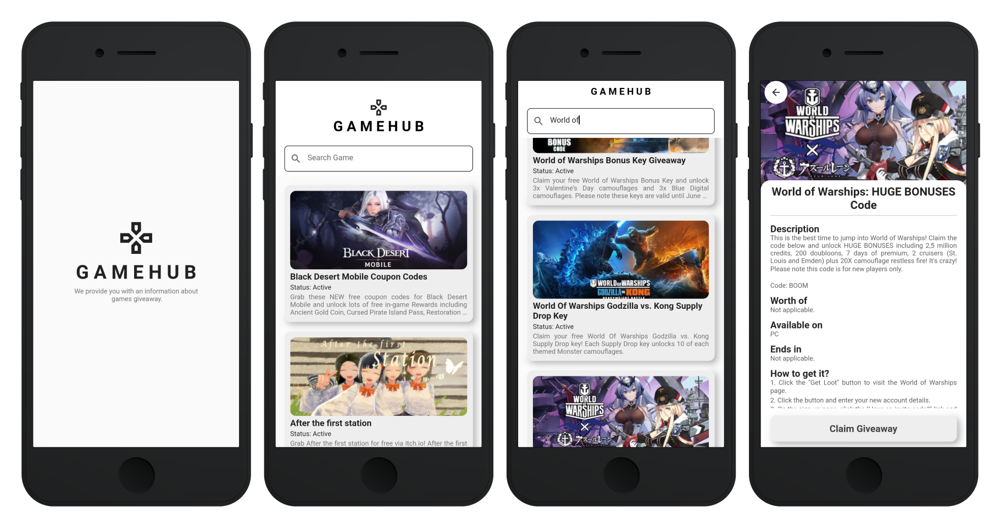

# GAMEHUB

A mobile app made using Flutter that provide an information about games giveaway. 
This application uses the GamerPower API as the content provided in it. Data retrieval 
from the API is assisted by using the Dio package with the GET method, which then will be 
displayed with the help of bloc as business logic in the application.

## App Preview




## Run Locally

Clone the project

```bash
  git clone https://github.com/AnggaPutraa/gamehub.git
```

Go to the project directory

```bash
  cd gamehub
  flutter clean
  flutter pub get
  flutter pub run build_runner build --delete-conflicting-outputs
  flutter build apk -t lib/main.dart
```


## Documentation

More information about the GamerPower API can be found [here](https://www.gamerpower.com/api-read).

